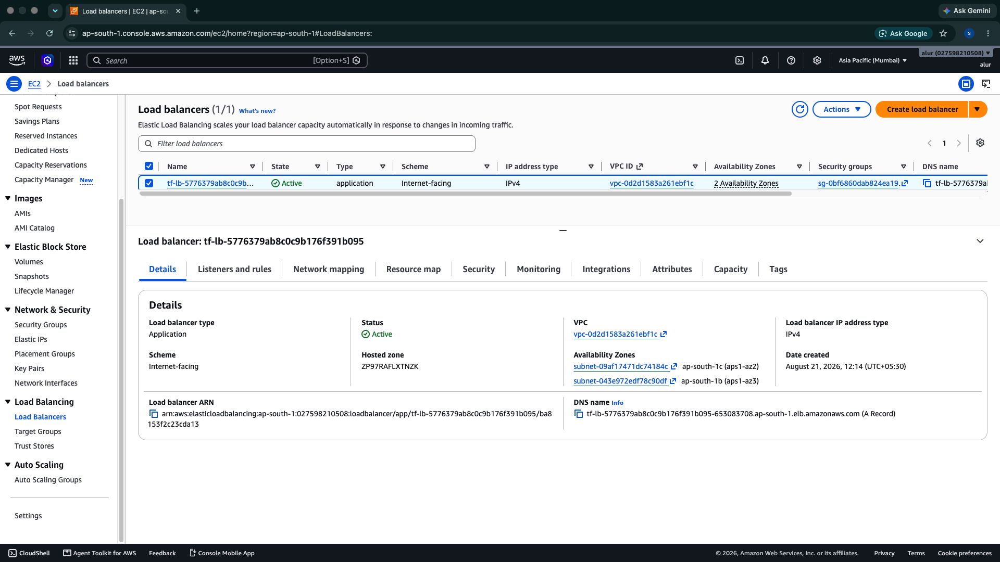
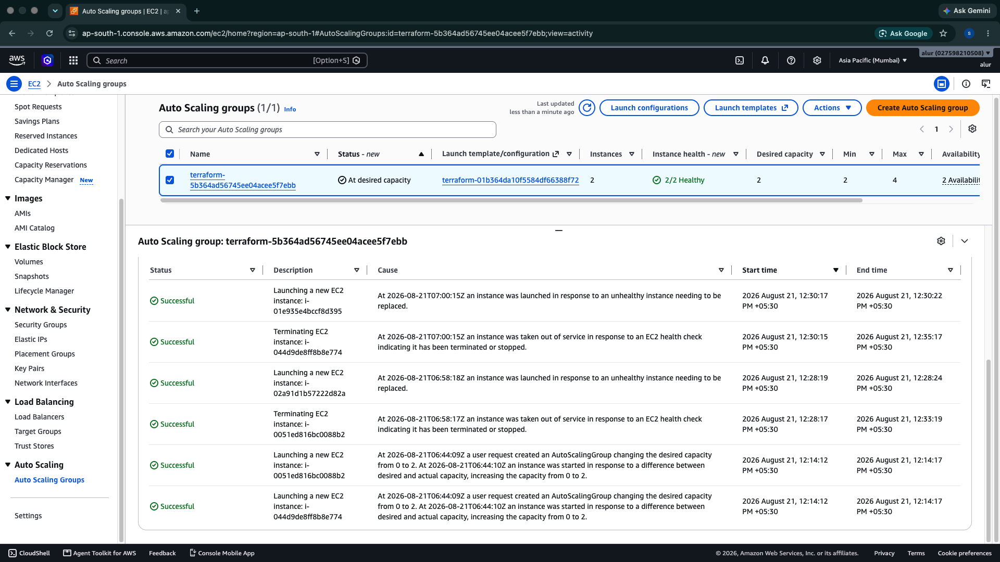
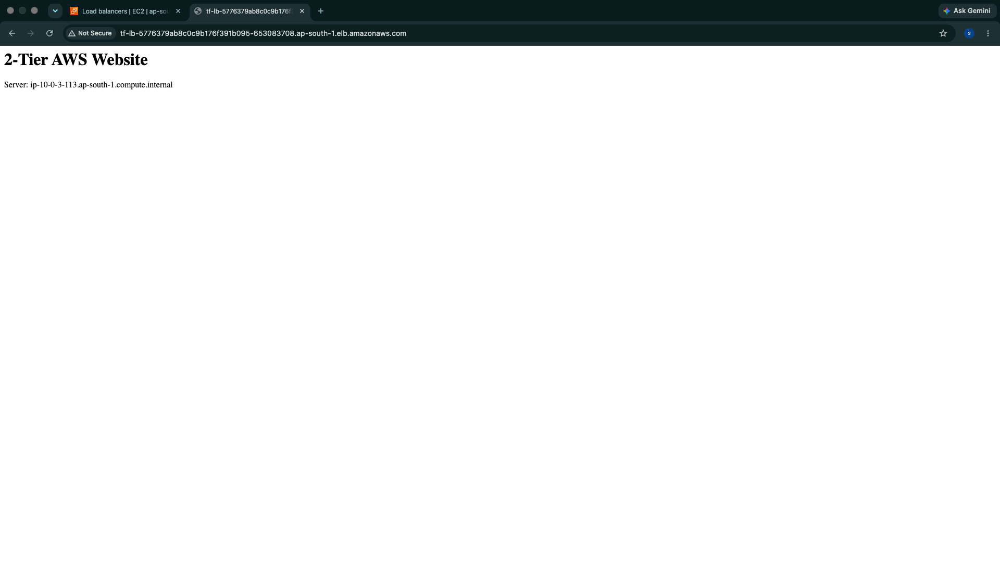
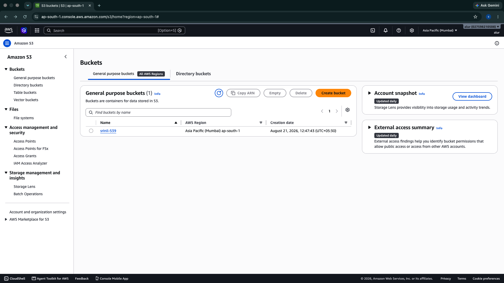
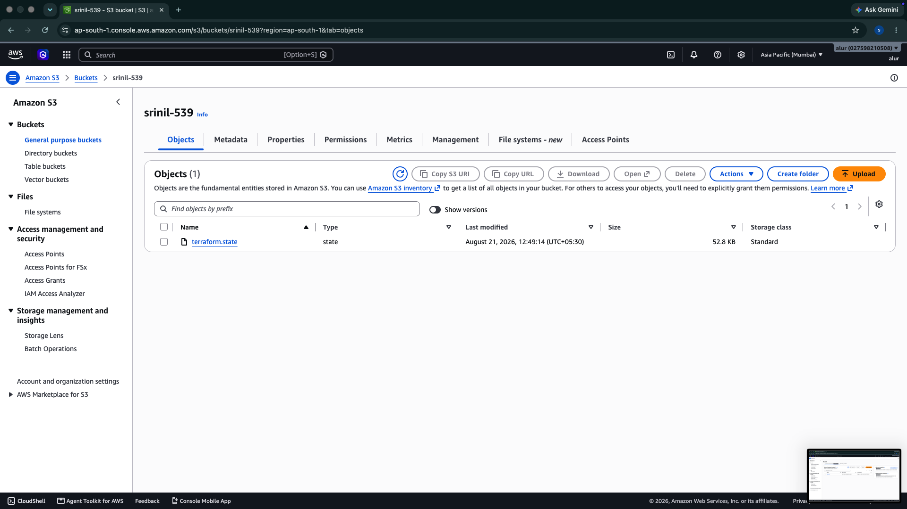
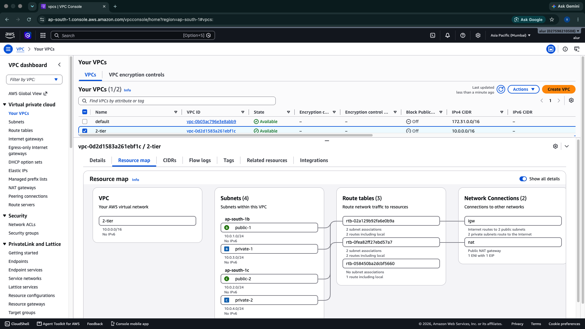

AWS Multi-AZ Application Infrastructure

AWS Multi-AZ Application Infrastructure with Terraform provisioned using Terraform, with host-level intrusion detection and a reusable security baseline through a Golden AMI.

## Architecture

```text
                         Internet
                            |
                            v
                Application Load Balancer
                  ┌─────────┴─────────┐
                  │                   │
            Public Subnet         Public Subnet
              AZ 1b                  AZ 1c
                  │                   │
                  └─────────┬─────────┘
                            |
                       Target Group
                            |
                 ┌──────────┴──────────┐
                 │                     │
            EC2 Instance          EC2 Instance
           Private Subnet         Private Subnet
              AZ 1b                  AZ 1c
                 │                     │
                 └──────────┬──────────┘
                            |
                       NAT Gateway
                            |
                     Internet Gateway

Security Layer:

        EC2 Host
           |
        CrowdSec
           |
    SSH brute-force detection
           |
      Ban decision
           |
   Firewall Bouncer
           |
        nftables
           |
     Malicious IP blocked
```

## Project Overview

This project demonstrates the design and deployment of a highly available AWS Multi-AZ Application Infrastructure  using Infrastructure as Code with Terraform.

The architecture separates the public load-balancing layer from the private application layer and uses Auto Scaling for application-instance self-healing.

Security is integrated into the infrastructure through CrowdSec host-level intrusion detection, automated firewall enforcement, and a Golden AMI containing the preconfigured security baseline.

## Key Features

* Custom VPC with `10.0.0.0/16` CIDR
* 2 public subnets across 2 Availability Zones
* 2 private subnets across 2 Availability Zones
* Internet Gateway for public subnet connectivity
* NAT Gateway for private subnet outbound connectivity
* Internet-facing Application Load Balancer
* Target Group with HTTP health checks
* EC2 Launch Template
* Auto Scaling Group with automatic instance replacement
* Security-group-based network isolation
* Apache HTTP server automated through EC2 user data
* CrowdSec host-level intrusion detection
* SSH brute-force detection using the `crowdsecurity/ssh-bf` scenario
* CrowdSec Firewall Bouncer with nftables enforcement
* Golden AMI with CrowdSec security baseline preconfigured
* EC2 IAM role and instance profile for CloudWatch Agent integration
* Terraform variables and outputs
* Remote state management via a versioned S3 backend
* Git/GitHub version control

## Infrastructure Metrics

| Component            | Configuration |
| -------------------- | ------------- |
| AWS Region           | `ap-south-1`  |
| Availability Zones   | 2             |
| VPC                  | `10.0.0.0/16` |
| Public Subnets       | 2             |
| Private Subnets      | 2             |
| EC2 Instance Type    | `t3.micro`    |
| ASG Desired Capacity | 2             |
| ASG Minimum          | 2             |
| ASG Maximum          | 4             |
| ALB Listener         | HTTP :80      |
| Application Port     | 80            |
| NAT Gateway          | 1             |
| Internet Gateway     | 1             |

## Network Design

### Public Layer

The public subnets contain the Application Load Balancer.

```text
0.0.0.0/0 → Internet Gateway
```

Public subnets:

* `10.0.1.0/24` — `ap-south-1b`
* `10.0.2.0/24` — `ap-south-1c`

Public IP assignment is enabled for resources launched in these subnets.

### Private Application Layer

EC2 application instances run in private subnets.

```text
0.0.0.0/0 → NAT Gateway
```

Private subnets:

* `10.0.3.0/24` — `ap-south-1b`
* `10.0.4.0/24` — `ap-south-1c`

Public IP assignment is disabled.

## Security Design

Traffic is controlled using separate security groups:

```text
Internet
   |
   | HTTP :80
   v
ALB Security Group
   |
   | HTTP :80
   v
Application Security Group
   |
   | MySQL :3306
   v
Database Security Group
```

### Security Controls

* ALB allows HTTP traffic from the internet.
* Application instances allow HTTP traffic only from the ALB security group.
* Database security group allows MySQL traffic only from the application security group.
* Application instances are deployed in private subnets.
* No direct internet ingress is allowed to the application instances.

> Note: The database security group is configured as part of the network/security design; an RDS database is not provisioned in this version of the project.

### CrowdSec Host Security

CrowdSec is used as the host-level intrusion detection and automated response layer for the EC2 instances.

```text
SSH authentication failures
          |
          v
      CrowdSec
          |
   ssh-bf scenario
          |
     Ban decision
          |
          v
 Firewall Bouncer
          |
          v
       nftables
          |
          v
   Malicious IP blocked
```

The implementation includes:

* CrowdSec Security Engine running on EC2
* SSH collection and `crowdsecurity/ssh-bf` scenario
* CrowdSec Firewall Bouncer
* nftables firewall enforcement
* Automated IP ban decisions

### CrowdSec Validation

The security workflow was tested with controlled SSH authentication failures.

The test produced a CrowdSec decision with:

```text
Reason:  crowdsecurity/ssh-bf
Action:  ban
Events:  6
```

The banned source IP was then verified in the CrowdSec nftables blacklist, confirming that the firewall bouncer enforced the CrowdSec decision at the host level.

The decision was also manually removed and the nftables blacklist was verified to be cleared, validating the full decision lifecycle.

## Golden AMI Security Baseline

A hardened EC2 instance was configured with CrowdSec and the firewall bouncer and then captured as a Golden AMI.

```text
Hardened EC2
     |
     | CrowdSec + Firewall Bouncer
     v
  Golden AMI
     |
     v
Launch Template
     |
     v
Auto Scaling Group
     |
   ┌─┴─┐
   v   v
 EC2  EC2
  |    |
CrowdSec already configured
```

A new EC2 instance was launched from the Golden AMI and verified with `systemctl` to confirm that CrowdSec was already installed and running without manually reinstalling it.

This provides a consistent security baseline for new and replacement instances launched through the Launch Template.

## IAM & CloudWatch

The project includes an EC2 IAM role and instance profile for CloudWatch Agent integration.

The IAM configuration uses the AWS managed `CloudWatchAgentServerPolicy` rather than embedding credentials on the EC2 instances.

## Auto Scaling & Self-Healing

The Auto Scaling Group is configured with:

```text
Desired: 2
Minimum: 2
Maximum: 4
```

### Tested Scenario

1. Started with 2 EC2 instances.
2. Terminated an EC2 instance managed by the ASG.
3. ASG detected the capacity reduction.
4. A replacement EC2 instance was automatically launched.
5. The replacement instance registered with the target group.
6. ALB health checks validated the instance.

**Result:** Auto Scaling successfully restored the desired capacity.

Because the Launch Template uses the Golden AMI, replacement instances can inherit the preconfigured CrowdSec security baseline.

## Load Balancer Testing

The application was accessed through the ALB DNS endpoint.

Target group configuration:

```text
Protocol: HTTP
Port: 80
Health Check Path: /
```

The ALB distributed traffic to healthy EC2 instances in the private subnets.

## Terraform Validation

The configuration was formatted and validated using:

```bash
terraform fmt
terraform validate
terraform plan
```

Validation completed successfully.

The final plan showed:

```text
Plan: 22 to add, 0 to change, 0 to destroy
```

The plan also generated outputs for:

* ALB DNS name
* VPC ID
* Public subnet IDs
* Private subnet IDs

## Remote State Management

Terraform state is stored remotely in a dedicated, versioned S3 bucket instead of locally, so state is durable, shareable, and protected against accidental loss or overwrite.

* **Backend:** S3
* **Bucket:** `srinil-539`
* **Region:** `ap-south-1`
* **State file key:** `terraform.state`
* **Bucket versioning:** Enabled

```hcl
terraform {
  backend "s3" {
    bucket = "srinil-539"
    key    = "terraform.state"
    region = "ap-south-1"
  }
}
```

The infrastructure was originally applied with local state. The backend was then reconfigured and the existing state migrated into S3 using `terraform init -migrate-state`, demonstrating backend reconfiguration on a live project rather than only a from-scratch remote setup.

## Project Structure

```text
.
├── alb.tf
├── asg.tf
├── backend.tf
├── iam.tf
├── launch_template.tf
├── output.tf
├── security.tf
├── variable.tf
├── vpc.tf
├── .gitignore
└── .terraform.lock.hcl
```

## Terraform Variables

The project uses variables for:

* VPC CIDR
* EC2 instance type

## Terraform Outputs

The project exposes:

* ALB DNS name
* VPC ID
* Public subnet IDs
* Private subnet IDs

## Deployment

### Initialize

```bash
terraform init
```

### Format

```bash
terraform fmt
```

### Validate

```bash
terraform validate
```

### Review

```bash
terraform plan
```

### Deploy

```bash
terraform apply
```

### Destroy

```bash
terraform destroy
```

## Validation & Testing

### Infrastructure Deployment

- Application Load Balancer actively routing traffic to healthy instances

### Target Group Health

- ASG maintaining 2 desired instances across AZ 1a and 1c
- Both instances registered and healthy in ALB target group

### Application Testing

- Application accessible via ALB DNS endpoint

### Terraform State Management


- Remote state stored in S3 with versioning and locking enabled

### Architecture Overview

- Complete VPC infrastructure with all resources deployed


## CI/CD with GitHub Actions

GitHub Actions is used to automatically validate Terraform changes and generate an AWS infrastructure plan on every push to `main` and every pull request targeting `main`.

### Workflow

```text
Git Push / Pull Request
          |
          v
     GitHub Actions
          |
          +--> Checkout repository
          |
          +--> Setup Terraform
          |
          +--> Configure AWS credentials
          |
          +--> Verify AWS identity
          |
          +--> terraform init
          |
          +--> terraform fmt -check -recursive
          |
          +--> terraform validate
          |
          +--> terraform plan
```

### AWS Authentication

This project currently authenticates GitHub Actions to AWS using encrypted GitHub repository secrets:

- `AWS_ACCESS_KEY`
- `AWS_SECRET_KEY`

The credentials are consumed by the `aws-actions/configure-aws-credentials` action and are not stored in the Terraform source code.

> **Security note:** Long-lived AWS access keys are suitable for demonstrating the workflow, but OpenID Connect (OIDC) with short-lived IAM role credentials is the preferred production approach because it avoids storing long-lived AWS credentials in GitHub.

### Terraform CI Checks

The workflow runs the following checks:

```bash
terraform init
terraform fmt -check -recursive
terraform validate
terraform plan -input=false
```

The pipeline does **not** automatically run `terraform apply`. This keeps infrastructure changes reviewable before deployment.

### Successful Pipeline

The completed workflow has been verified successfully in GitHub Actions, including:

- AWS credential configuration
- AWS identity verification
- Terraform initialization
- Terraform formatting check
- Terraform validation
- Terraform plan

This demonstrates an end-to-end Infrastructure-as-Code validation pipeline for the AWS environment.

### GitHub Actions Workflow File

```text
.github/workflows/terraform.yml
```

## Technologies

**AWS · Terraform · Linux · Git · GitHub · CrowdSec · nftables · Golden AMI · CloudWatch**

## Author

**Srinil Reddy**
